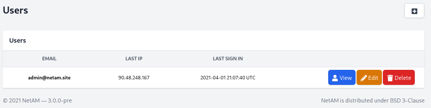
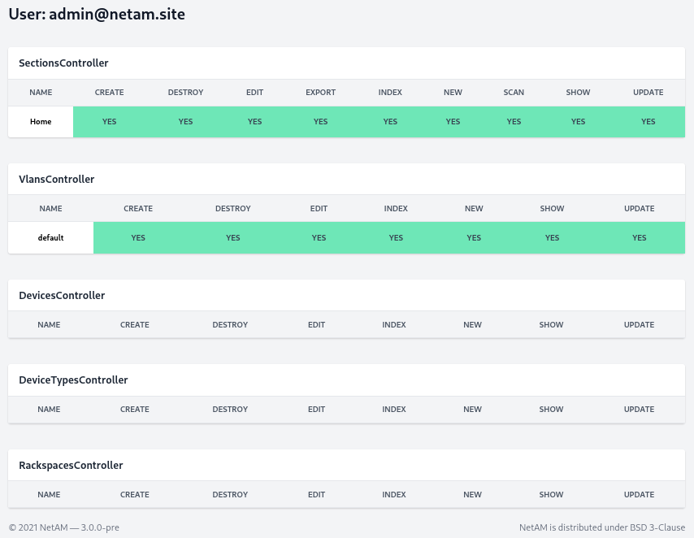
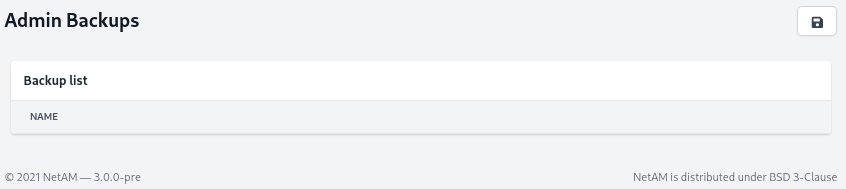
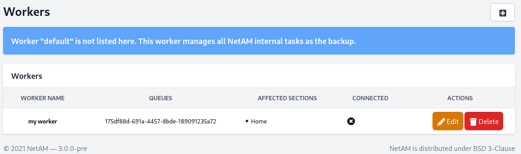
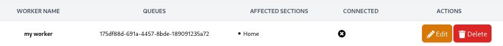
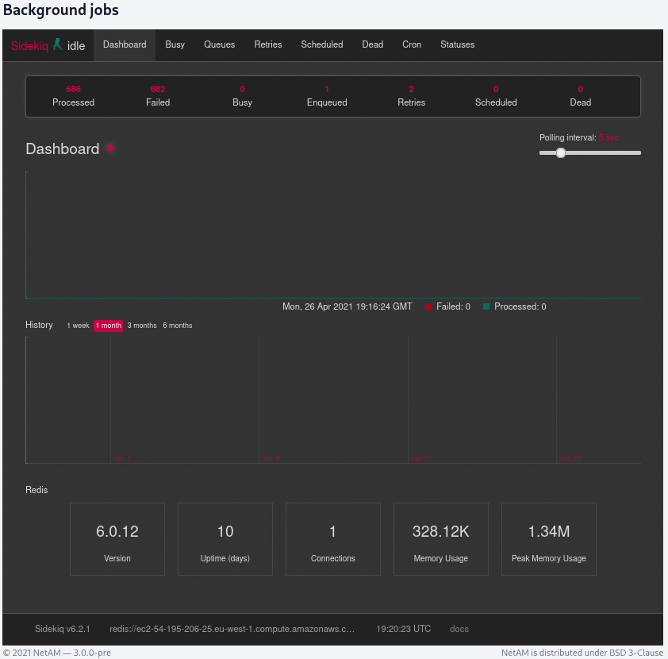

# Administration guide
In this guide we will see how to administrate the NetAM stack

## Users
In Admin Center you have the capability to create, edit or remove users.



When you are on the user page, you can also see its permissions on different NetAM module. 



## Backups
You can launch a database backup directly from the interface.



## Workers
To allow you to split load between multiple workers, we provide a worker registration space.

The default worker is installed on the same host as NetAM manager and cannot be managed, it is used only for internal tasks.



### How to add worker to NetAM
When you have created your worker with their name, and their affected section, you can launch it.



To start your new NetAM worker, you can use [docker-compose](https://github.com/NetaM-OSC/NetAM/blob/dev/docker-compose.worker.yml) located on GitHub.
```yaml
version: '3.7'

services:
  worker:
    build:
      context: .
      dockerfile: Dockerfile
    image: netam/netam
    environment:
      SECRET_KEY_BASE: v1jFMms5qurpiYdw
      SENTRY_DSN: ''
      REDIS_HOST: 10.0.0.10
      DB_HOST: 10.0.0.10
      DB_NAME: netam
      DB_USER: admin
      DB_PASS: _PASSWORD_
    restart: always
    command: sidekiq -q "node:175df88d-691a-4457-8bde-189091235a72"

```

## Sidekiq
If you are an advanced user of Sidekiq, you have direct access to Sidekiq dashboard.



## Stack management
### Upgrade stack
After you have installed the NetAM stack, you can update with two commands:

```shell
docker-compose pull 
docker-compose up -d
```
