# Usage guide

## Login / Register
-------------------

This is where you login after creating an account or using your LDAP server.

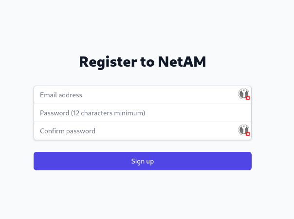

When you don't use your LDAP server, you will create your account here.

We recommend using a strong password.

# Main
------

After login , you will be redirected on the main page.

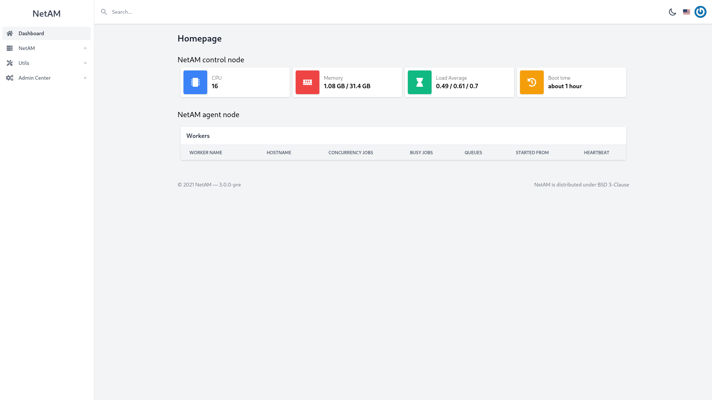

On the top center, you will have the search bar where you can find all your sections and access them.

On the center, you will have all the information of :

* The control node
    * CPU core
    * Memory Usage
    * Load Average
    * Uptime
*  Agent node

On the top right, you can change the theme (light / dark), change your language and user settings.

On the left, you have all the tools proposed by NetAM.

# Section
---------

This is where you can see all of your sections created with usage info, buttons to View, Scan, Edit or Delete a section

## View Section

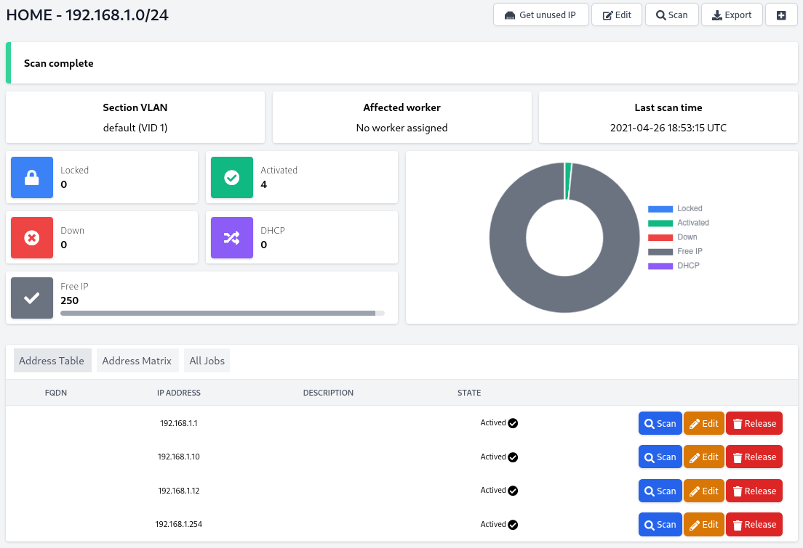

On the View page, you have all the information of your network :

* Section VLAN
* Affected worker
* Last scan time

Network information :

* Locked IP
* Down IP
* Activated IP
* DHCP IP
* Free IP

On the bottom, you have 3 tabs where you can see your network in a different view.

### Address table

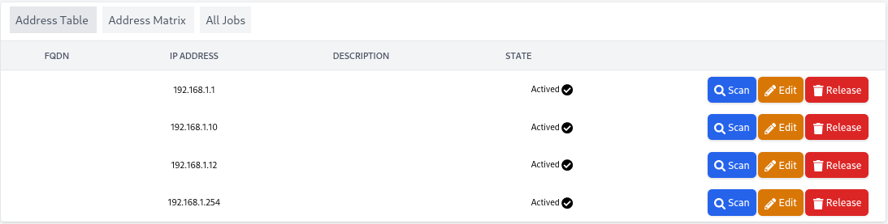

### Address Matrix

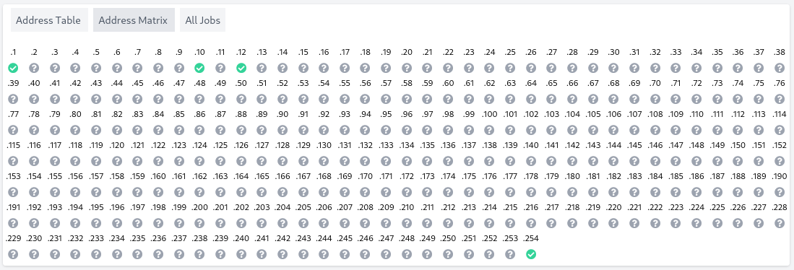

### All Jobs

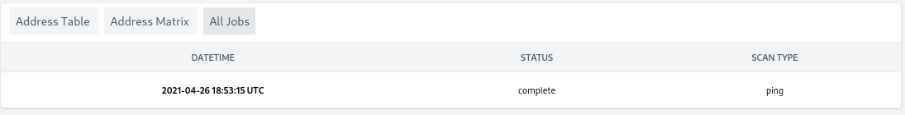

Here are some logs for each job executed on this network.

## Create Section

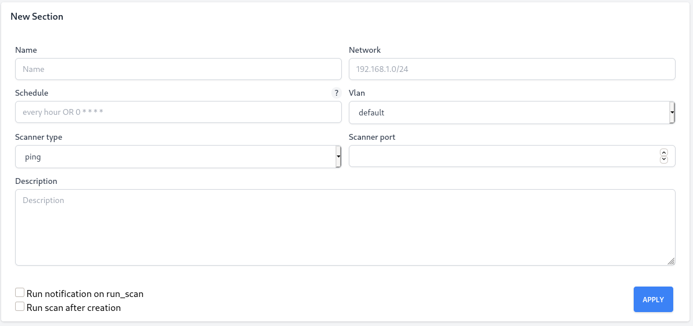

After creating your section, you will return on the section page.

# Vlans
-------

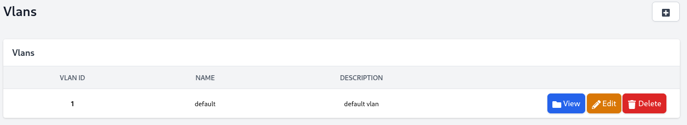

This is where you can see all of your vlans created with info, button for View, Edit or Delete vlan.

Note : The default vlan here has been manually created.

## Vlan view

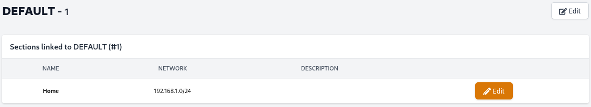

On this page, you can see all sections using a chosen vlan.

## Vlan edit

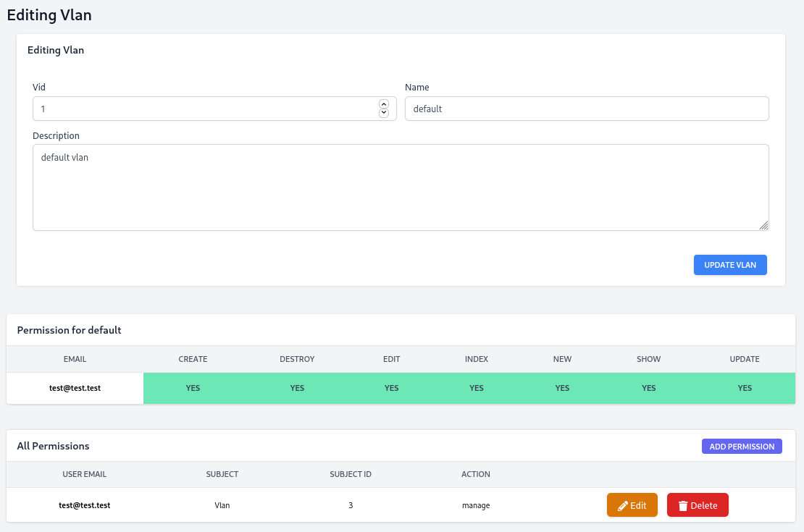

## Create Vlan

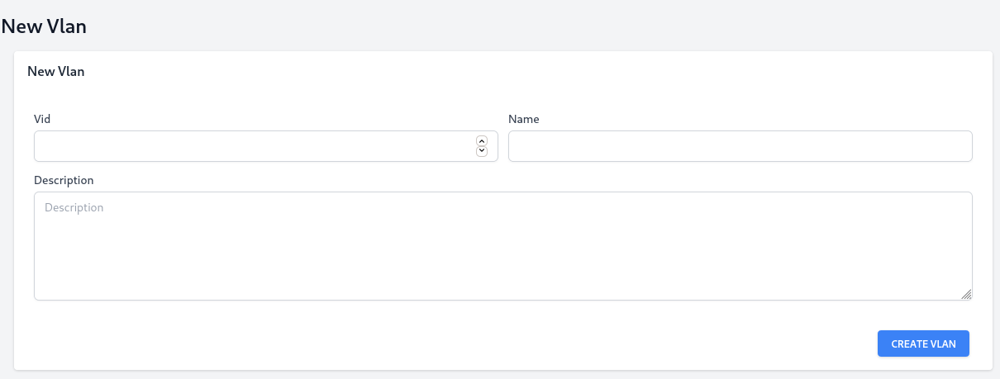

* Vlan ID (Vid)
* Name of your vlan
* Description

# Devices
---------

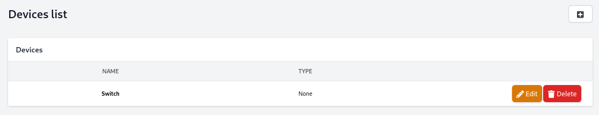

Define a device. You can edit their:

* Type (cf. [device_type](#devices_type)) of your devices
* Rack Height
* Depth Type
    * Small
    * Half
    * Full
* Rackspace
* Rack anchor

## Create Device

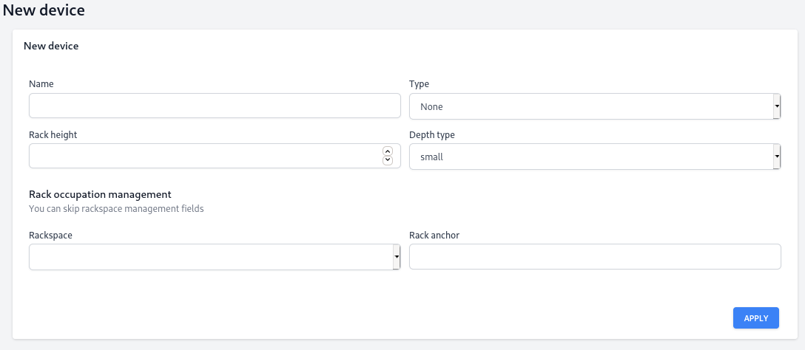

## Edit Device

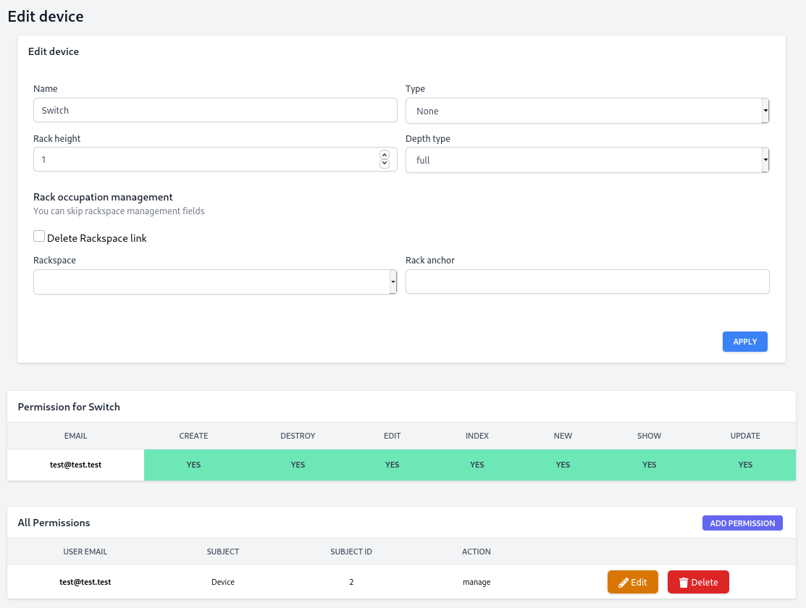

# Devices Type
--------------

Define a type of devices, you can change the color of the devices.

## Create Device Type

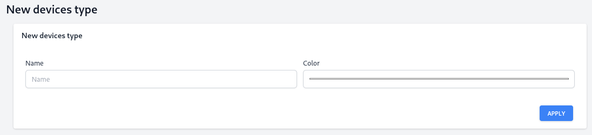

## Edit Device Type

# Rackspaces
------------

Rackspace section where you can create your rackspace for organization.

## Create Rackspaces

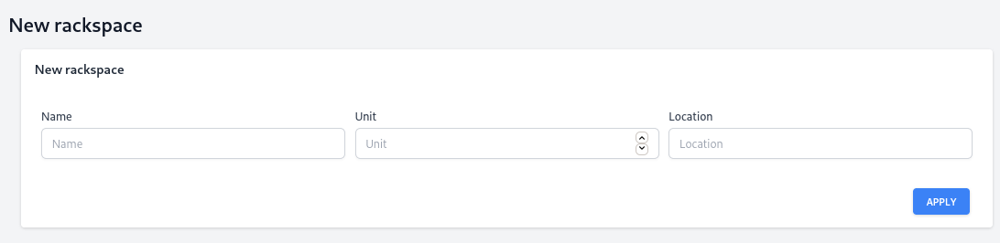

## Edit Rackspaces

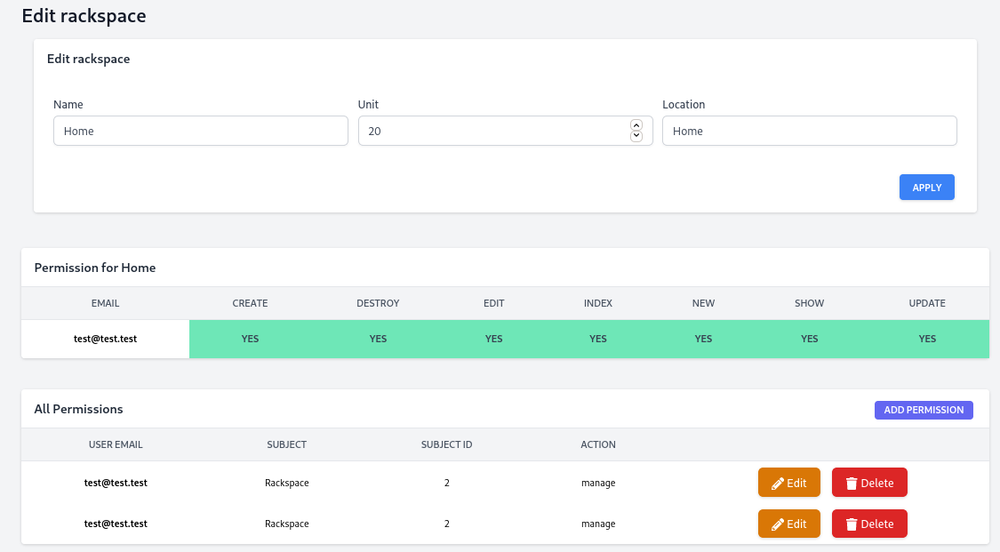

## View Rackspaces

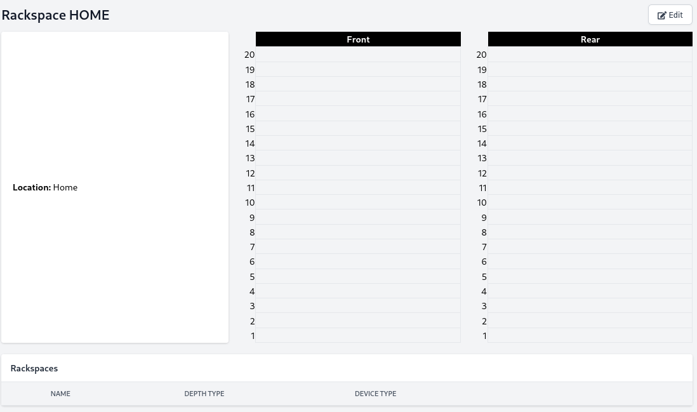

# Utils
-------

## IP Calculator

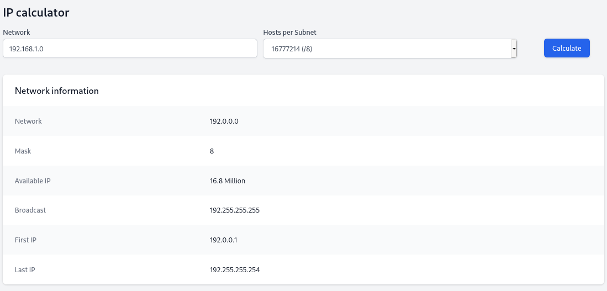

Calculate network range per subnet.

## MAC Vendor

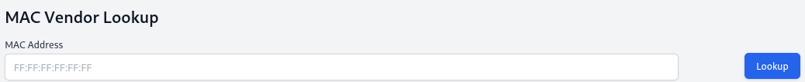

Found a vendor with a Mac Address.

## Network Splitter

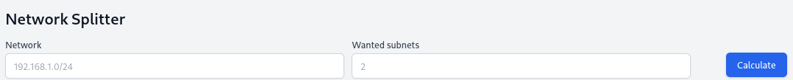

Split a network range by a number of subnet.

## PTR Resolver

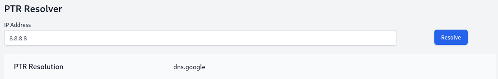

Resolve a PTR

## DNS Resolver

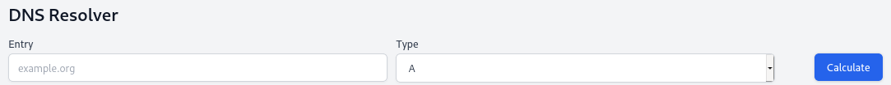

Resolve a DNS information

## Whois

Whois tools for DNS / IP address info.

