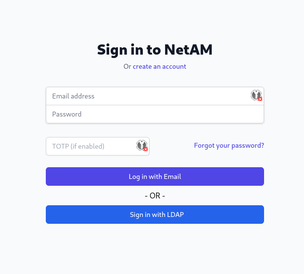
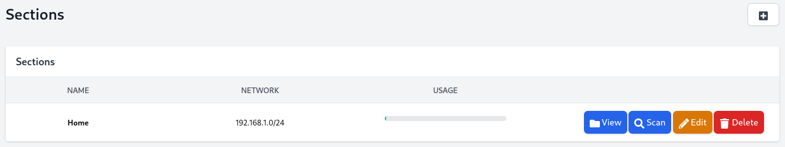
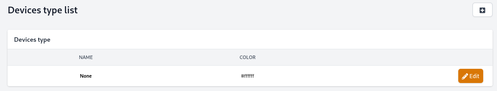
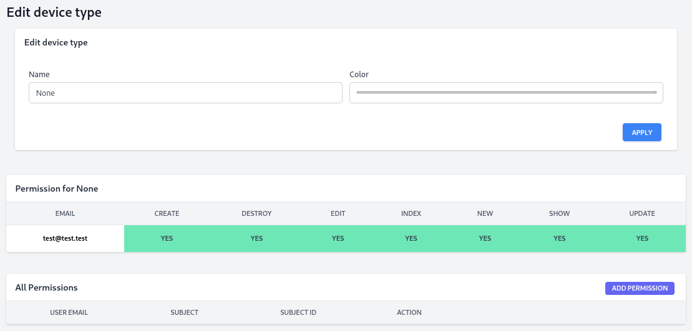
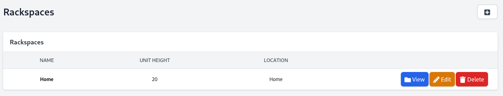

# Usage guide

## Login / Register
-------------------

This is where you login after creating an account or using your LDAP server.

When you don't use your LDAP server, you will create your account here.

We recommend use a strong password.

# Main
------

After login , you will be redirected on the main page.

On the top center, you will have the search bar where you can find all of your sections and 

On the center, you will have all the information of :

* The control node
    * CPU core
    * Memory Usage
    * Load Average
    * Uptime
*  Agent node

On the top right you can change the theme (light / dark), change your language and user settings.

On the left, you have all the tools purposed by NetAM.

# Section
---------

This is where you can see all of your sections created with usage info, button for View, Scan, Edit or Delete a section

## View Section

In the View page, you have all the information of your network :

* Section VLAN
* Affected worker
* last scan time

Network information :

* Locked IP
* Down IP
* Activated IP
* DHCP IP
* Free IP

On the bottom, you have 3 tabs where you can see your network in a different view

### Address table

### Address Matrix

### All Jobs

It's logs for job executed on this network.

## Create Section

After creating your section, you will return on the section page.

# Vlans
-------

This is where you can see all of your vlans created with info, button for View, Edit or Delete vlan.

Note : The default vlan here has been manually created.

## Vlan view

In this page, you can see all of your section using your vlan.

## Vlan edit

## Create Vlan

* Vlan ID (Vid)
* Name of your vlan
* Description

# Devices
---------

## Create Device

## Edit Device

# Devices Type

## Create Device Type

## Edit Device Type

# Rackspaces
------------

## Create Rackspaces

## Edit Rackspaces

## View Rackspaces

# Utils
-------

## IP Calculator

## MAC Vendor

## Network Splitter

## PTR Resolver

## DNS Resolver

## Whois

